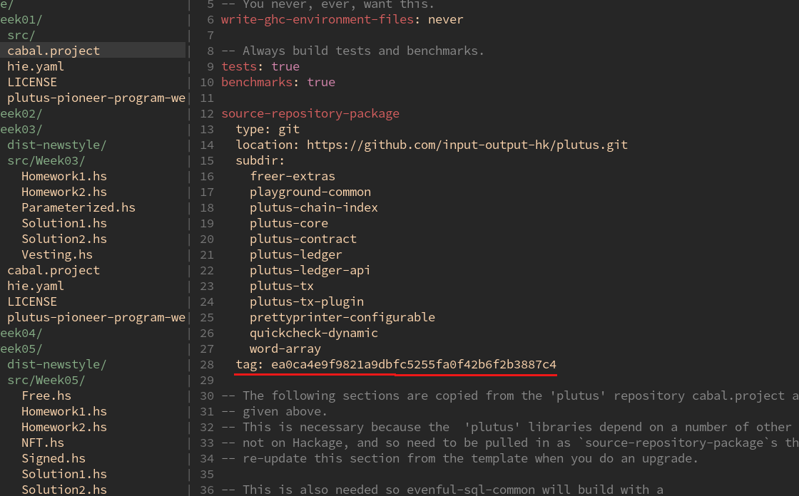

### Start your local plutus playground
Github repo of plutus [pioneer program](https://github.com/input-output-hk/plutus-pioneer-program)

#### For week01 to week03 you need to start local playground

1. copy git tag `ea0ca4e9f9821a9dbfc5255fa0f42b6f2b3887c4` from ~/plutus-pioneer-program/week-xy/cabal.project

2. git checkout ${git_tag_above}, for eg:
`git checkout ea0ca4e9f9821a9dbfc5255fa0f42b6f2b3887c4`
3. turn nix shell on
```
# assume that you are at ~/plutus
nix-shell
```
4. start plutus playground server
```
# assume that you are at ~/plutus
cd plutus-playground-client/
./plutus-playground-server
```
5. start plutus playground cliennt
```
# assume that you are at ~/plutus
cd plutus-playground-client/
npm run start
```
now, you can view plutus playground client at https://localhost:8009

6. if any error related to npm packages
```
# assume that you are at ~/plutus/plutus-playground-client/
rm -rf node_modules/
npm install --save-dev webpack
npm install --save-dev webpack-cli
```

#### From  week04 to week10

Just need `cd` to week you wanna learn
then run
```
cabal repl -v
```
